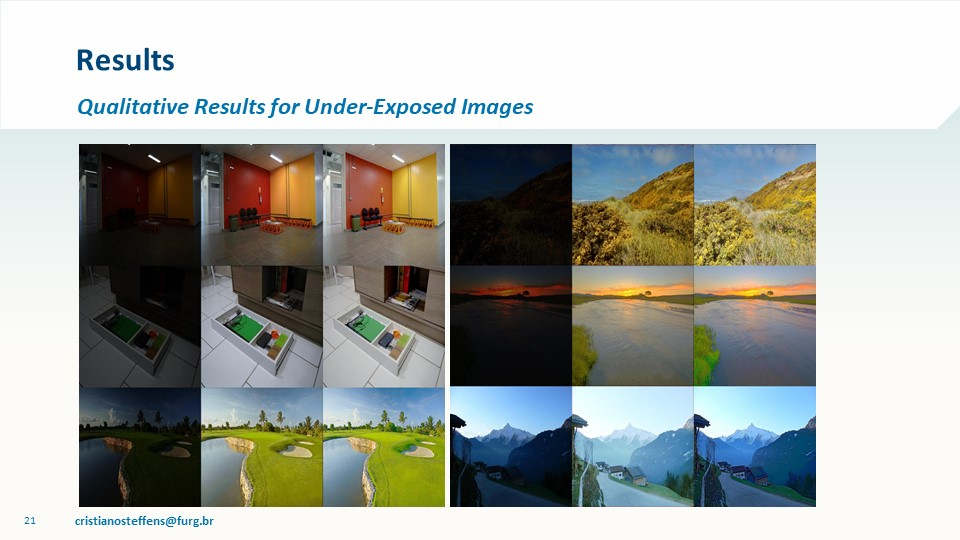
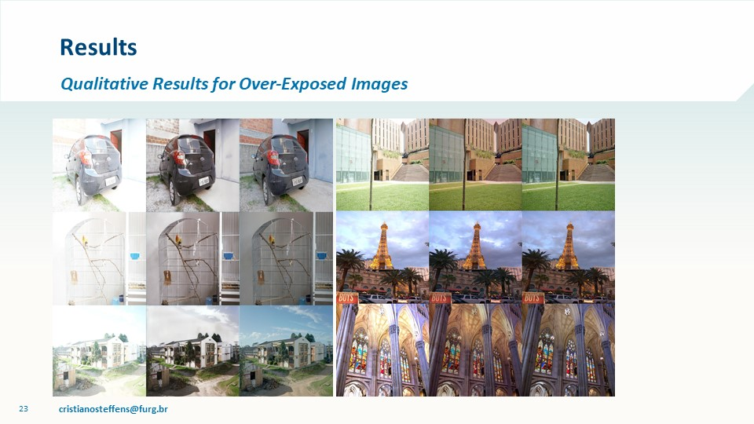

# ReExposeNet

Pre-trained model to reproduce results presented in 

Contrast Enhancement and Image Completion: A CNN Based Model to Restore Ill Exposed Images

by C. R. Steffens,L. R. V. Messias, P. L. J. Drews-Jr and S. S. C. Botelho

Results on Under-exposed Images



Results on Over-exposed Images




```
@INPROCEEDINGS{steffens2019reexposenet,
author={C. R. {Steffens} and L. R. V. {Messias} and P. L. J. {Drews-Jr} and S. S. C. {Botelho}},
booktitle={2019 IEEE 17th International Conference on Industrial Informatics (INDIN)},
title={Contrast Enhancement and Image Completion: A CNN Based Model to Restore Ill Exposed Images},
year={2019},
pages={8},
month={July},
organization={IEEE},
venue={Helsinki-Espoo, Finland}
}
```


Keywords: Image Enhancement, Image Restoration, Saturation, In-painting, Image Processing, Deep Learning.

Have a look at the [a6300 Multi-exposure dataset](https://github.com/steffensbola/a6300_multi_exposure_dataset)

Trained with Keras / TensorFlow 1.11.0 on a Titan X GPU. The only limitation is that your input image is in the RGB format, with a resolution multiple of 8 (e. g. 512x512, 1080x720, 1920x1080,...). RGB colorspace. The aspect ratio of the input image does not matter.
